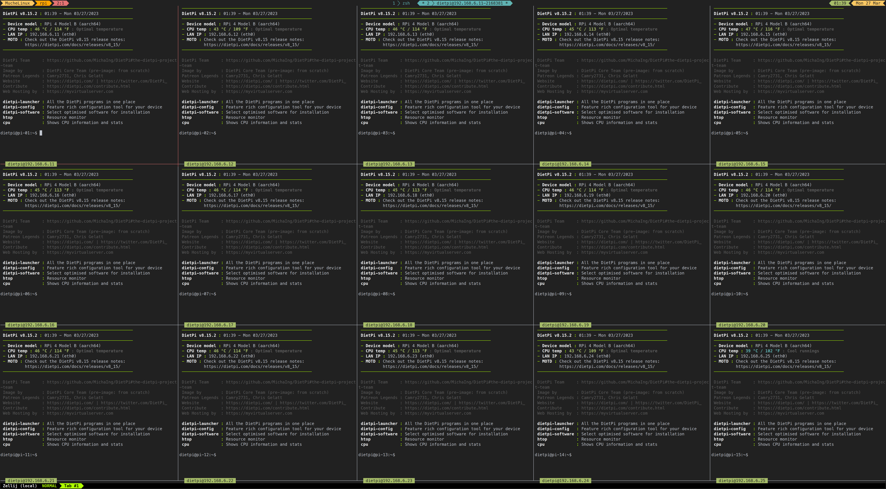

# Raspberry Pi Cluster Setup

<!-- vim-markdown-toc GFM -->

* [Clone Repo](#clone-repo)
* [Prepare Raspberry Pis](#prepare-raspberry-pis)
    * [Rack N Stack](#rack-n-stack)
* [Install K3S](#install-k3s)
    * [Pre-requisites](#pre-requisites)
    * [Install](#install)
    * [Test](#test)
* [Infra as Code (WIP)](#infra-as-code-wip)

<!-- vim-markdown-toc -->

## Clone Repo
Clone this repo recursively with included submodules.
```
git clone --recursive https://github.com/harshasrisri/pi-cluster.git
```

## Prepare Raspberry Pis
We'll be using [Ubuntu Server](https://ubuntu.com/download/raspberry-pi) image for our Raspberry PIs in the cluster. We use the included `prepare_sdcard.sh` script to:
- Take a number range `n1..n2` as arguments to set `pi-${n}` as hostname of a Pi
- Ensure a few specific environment variables are set
- Display environment variables and summary of operations
- Unmount SD card partition(s) and write Image to SD card
- Edit partition table to expand filesystem to fill available space
- Repair and resize filesystem to commit above changes
- Eject and remount SD card to configure it for hostname
- Use `user-data` file to configure SD card using [Cloud Init](https://cloudinit.readthedocs.io)
```
./prepare_sdcard.sh
Usage: ./prepare_sdcard.sh <start_range> <end_range>

# To prepare 15 SD cards one after another
./prepare_sdcard.sh 01 15
...
```

### Rack N Stack
Rack up all the PIs, connect them all to the network, and they should be available as `pi-01`, `pi-02`, etc.
```
xpanes -C 5 --ssh ansible@pi-{01..15}

```


## Install K3S
### Pre-requisites
On each of the Raspberry PI, run (using the [`xpanes`](https://github.com/greymd/tmux-xpanes) command above):
- `sudo apt install linux-modules-extra-raspi` as per Rancher's docs to enable VxLan on Ubuntu Server for Raspberry PI
- `sudo ufw allow proto tcp from 192.168.1.0/24 to any port 6443` to allow incoming traffic from `192.168.1.*` into port 6443

### Install
Simplest way to install K3S has been to follow [K3S-Ansible](https://github.com/k3s-io/k3s-ansible). The version used at the time of setting up this cluster is linked in this repo as a submodule. Make a link to our cluster config in the K3S submodule. Our config lists the hostnames of Pis used in the cluster and sets some server side arguments.
```
cd k3s-ansible/inventory && ln -s ../../my-cluster
```

### Test
Install `kubectl` on your local machine with `Homebrew` or your favorite package manager.

The last step in the `k3s-ansible` README is to copy `~/.kube/config` from the master node to local machine.

Now, on your local machine, you should be able to do something like this:
```
❯ kubectl get nodes -o wide
NAME    STATUS   ROLES                  AGE   VERSION        INTERNAL-IP     EXTERNAL-IP   OS-IMAGE           KERNEL-VERSION      CONTAINER-RUNTIME
pi-15   Ready    <none>                 41m   v1.22.3+k3s1   192.168.1.136   <none>        Ubuntu 22.04 LTS   5.15.0-1013-raspi   containerd://1.5.7-k3s2
pi-10   Ready    <none>                 42m   v1.22.3+k3s1   192.168.1.197   <none>        Ubuntu 22.04 LTS   5.15.0-1013-raspi   containerd://1.5.7-k3s2
pi-08   Ready    <none>                 42m   v1.22.3+k3s1   192.168.1.161   <none>        Ubuntu 22.04 LTS   5.15.0-1013-raspi   containerd://1.5.7-k3s2
pi-03   Ready    <none>                 42m   v1.22.3+k3s1   192.168.1.57    <none>        Ubuntu 22.04 LTS   5.15.0-1013-raspi   containerd://1.5.7-k3s2
pi-04   Ready    <none>                 42m   v1.22.3+k3s1   192.168.1.106   <none>        Ubuntu 22.04 LTS   5.15.0-1013-raspi   containerd://1.5.7-k3s2
pi-01   Ready    control-plane,master   88m   v1.22.3+k3s1   192.168.1.70    <none>        Ubuntu 22.04 LTS   5.15.0-1013-raspi   containerd://1.5.7-k3s2
pi-09   Ready    <none>                 42m   v1.22.3+k3s1   192.168.1.133   <none>        Ubuntu 22.04 LTS   5.15.0-1013-raspi   containerd://1.5.7-k3s2
pi-13   Ready    <none>                 41m   v1.22.3+k3s1   192.168.1.199   <none>        Ubuntu 22.04 LTS   5.15.0-1013-raspi   containerd://1.5.7-k3s2
pi-12   Ready    <none>                 41m   v1.22.3+k3s1   192.168.1.12    <none>        Ubuntu 22.04 LTS   5.15.0-1013-raspi   containerd://1.5.7-k3s2
pi-05   Ready    <none>                 42m   v1.22.3+k3s1   192.168.1.151   <none>        Ubuntu 22.04 LTS   5.15.0-1013-raspi   containerd://1.5.7-k3s2
pi-02   Ready    <none>                 42m   v1.22.3+k3s1   192.168.1.154   <none>        Ubuntu 22.04 LTS   5.15.0-1013-raspi   containerd://1.5.7-k3s2
pi-07   Ready    <none>                 42m   v1.22.3+k3s1   192.168.1.34    <none>        Ubuntu 22.04 LTS   5.15.0-1013-raspi   containerd://1.5.7-k3s2
pi-14   Ready    <none>                 41m   v1.22.3+k3s1   192.168.1.17    <none>        Ubuntu 22.04 LTS   5.15.0-1013-raspi   containerd://1.5.7-k3s2
```

## Infra as Code (WIP)
[Funky Penguin's Geek Cookbook](https://geek-cookbook.funkypenguin.co.nz/) is a great resource to manage our pi-cluster like a farm and our services like cattle. 

Unfortunately, I gave up on it and couldn't continue with this method for 2 reasons:
- Broke the raspberry-pi cluster while configuring static IPs it took a long time to bring it back up. Configuring Static IPs on Ubuntu using `cloud-init` didn't work at all. Finally, settled on re-doing my cluster using a much more lightweight Debian-based distribution called [DietPi](https://dietpi.com/)
- Even after configuring all the pis with static IPs, setting up Metallb via fluxcd using a dedicated subnet always ended up in a failure.
